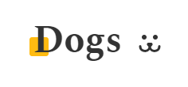
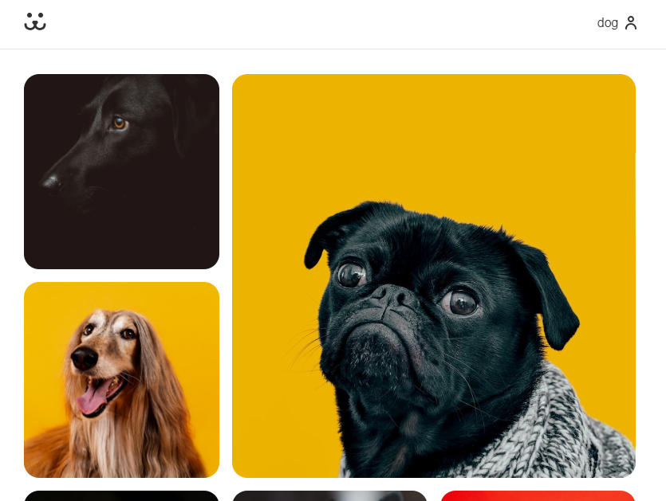

<div style="display:flex;align-items:center;justify-content:center;witdh:100%">
  
</div>

> Dogs - Projeto destinado a aprimorar meus conhecimentos em React. Uma aplicação de uma rede social para cachorros, criada no curso de React da Origamid.

      

## 🚧 Estágio de desenvolvimento 🚧

>O projeto ainda está em desenvolvimento e as próximas atualizações serão voltadas nas seguintes tarefas:

* [x] Responsividade para mobile
* [ ] Feed com lazy loading das postagens
* [ ] Sessão de comentários nas postagens
* [ ] Separação de postagens por usuário
* [ ] Otimização do CSS
* [ ] Tema escuro

## 🤖 Demonstração📱



## ⚙️ Tecnologias usadas ⚙️
       

## 🔨 Como usar 💻

```
Clone esse repositório
$ git clone https://github.com/ju-lio/dogs

Instalar dependências
$ npm install

Inicie o projeto
$ npm start
```

## 🔗 Acessar 🚀

A versão mais recente para demonstração está sendo hospedada aqui mesmo pelo GitHub e pode ser acessada clicando [aqui](https://ju-lio.github.io/).